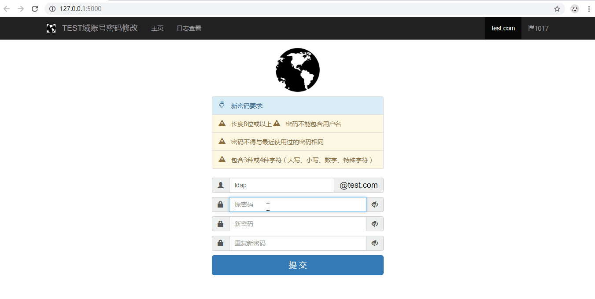

##
    计划使用Golang和Element-Plus重新开发, 单文件方便部署

## 使用前提

**域控必须启用ldaps**

[https://blog.csdn.net/LeoForBest/article/details/75204649](https://blog.csdn.net/LeoForBest/article/details/75204649)

## 更新说明

**旧版请查看Tag V1.0.0**

## 修改`app\config-sample.py`配置文件为`app\config.py`

```python
"""
    ad-password.config
    ~~~~~~~~~~~~~~~~~~

    :time 2019/5/15 19:33
    :copyright: (c) 2019 by Leo.
    :license: BSD, see LICENSE for more details.
"""

# 域信息配置
NETBIOS_NAME = 'TEST'
SERVER = '172.25.1.3'
BIND_USER = 'test@test.com'		# 使用用户的UserPrincipalName属性名绑定
BIND_PWD = 'Aa123456'
SEARCH_BASE = 'dc=test,dc=com'
MAIL_SUFFIX = 'test.com'

# 网站信息配置
TITLE = '域账号密码修改'
COPYRIGHT = 'Copyright © 2019 test.com  All rights reserved.'

# 允许查看日志信息的人员
log_admin = [
    'test',     # 管理员1
    'test1',    # 管理员2
    'test2'     # 管理员3
]

# ！！！请修改SECRET_KEY字符串为随机密钥！！！
SECRET_KEY = 'SomeRandomKeys'
SQLALCHEMY_DATABASE_URI = 'sqlite:///db.sqlite3'
SQLALCHEMY_TRACK_MODIFICATIONS = False

```

## 运行`run.py`，本地测试

- 安装依赖库

```bash
pip install -r requirements.txt
```

- 双击运行run.py测试




## 部署

**可参考搜索`Flask`部署**